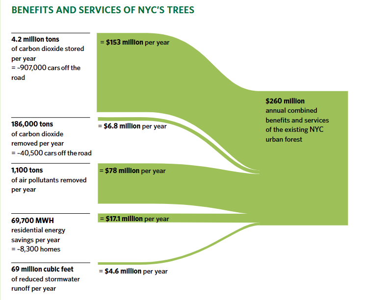
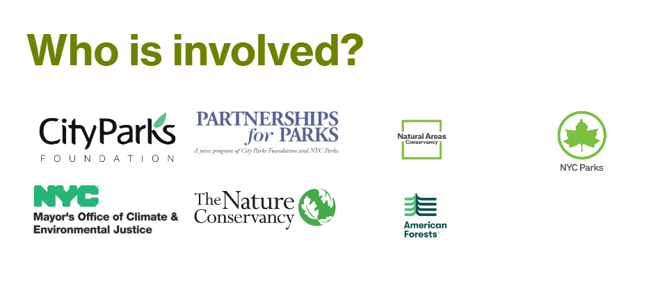
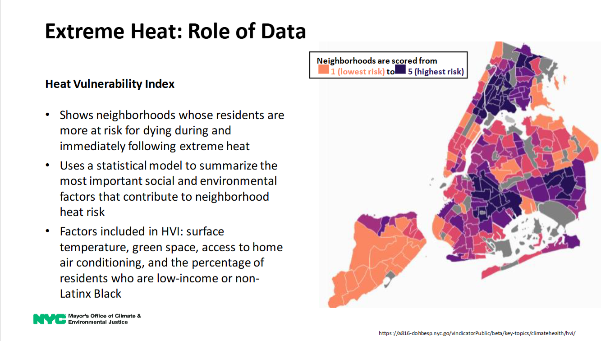

# Heat-Stress in New York City

### Policy Paper

**Descha Daemgen**
*August 21, 2026*

---

## Executive Summary

> **Mitigating Heat-Stress in New York City**
>
> Like most major urban areas, New York City is increasingly at risk of experiencing extreme-heat events with record high summer temperatures and consequent health impacts on vulnerable populations. As of the latest data from 2021, tree canopy—defined as the land covered or shaded by trees—covers only 23.4% of New York City, and neighborhoods particularly vulnerable to heat are under-served (City of New York, 2023a; New York City Mayor's Office of Climate and Environmental Justice, 2023). While recent laws will implement canopy expansion to 30% by 2035, organizational silos and uneven data access have hampered efforts (NYC City Council, 2023b). This policy report not only reviews evidence on the cooling effects of efficient planting of urban trees but looks to the institutional landscape in which this planting takes place. We find that communication gaps between departments but also structural inefficiencies obtain: for instance, the Parks Department manages most trees but has no city-wide mandate to coordinate a coherent heat policy.
>
> We propose the implementation of data science interventions alongside a proposal that takes current governance protocols into account. Specifically, NYC's already extant 3D LiDAR data and street-level tree inventories can be used in conjunction with machine learning tools (convolutional models for accurate canopy mapping and the optimization of planting sites) to prioritize planting in those neighborhoods that are the hottest and most under-served. Policy initiatives addressed in this report include enforcing the new 2023 Urban Forest Plan Law by integrating specific tree targets into all zoning and infrastructure projects and creating a tree planting strategy that comprises multiple city departments through the creation of a "Tree Data Dashboard". We also recommend the creation of a "Tree and Heat Atlas" that combines Heat Vulnerability Index (HVI) data with Machine Learning-driven site prioritization. The project's success will be tracked by metrics such as canopy cover by neighborhood, number of hours of shade gained, and reduction in heat-related health outcomes. By utilizing data science methods alongside insights into the coordination of urban policy, NYC can systematically improve its "heat equity" while efficiently cooling its streets.

---

## 1. Introduction

The density of New York City's built environment, in combination with climate change, makes the city increasingly susceptible to extreme heat events. The concrete and asphalt that make up New York City's urban landscape absorb solar radiation during the day and retain it. Summers now routinely exceed 90°F (32.2°C), with 2024 being the warmest year on record (NOAA, 2025). This level of heat intensifies health risks. NYC health data show a marked uptick in heat-related hospital visits during extreme heat events, especially among the elderly and low-income residents without air-conditioning (NYC Department of Health and Mental Hygiene, 2025). Trees offer a solution: mature urban trees can cool the air by about 2°F (1°C) and forested natural areas are on average 6°F (3.31°C) cooler than their surrounding area (New York City Mayor's Office of Climate and Environmental Justice, 2023). In addition to health benefits, the economic value of these trees is staggering. A city-led study found that through the removal of 1,100 tons of air pollution, the reduction of stormwater runoff by 69 million cubic feet, and residential energy savings equivalent to the annual energy usage of 8,300 homes, trees in NYC provide $260 million in benefits every year (New York City Mayor's Office of Climate and Environmental Justice, 2023).

  

<em>Figure 1: Monetary benefit of NYC's trees. Source: The Nature Conservancy, 2021.</em>

However, the trees that NYC already has are unequally distributed: low-income and majority Black/Latinx neighborhoods often have less tree coverage and higher heat mortality rates. One study even found that poorer neighborhoods suffer from poorer tree placement, with areas like Ozone Park in Queens suffering more ill-effects from heat than the richer neighborhood of Park Slope in Brooklyn, despite similar tree counts (Kobald & Yoon, 2023).

Recognizing this, NYC has implemented concrete plans for canopy expansion. In 2023, the City Council passed Local Law 148, known as the Urban Forest Plan, which will give teeth to the city's aspirations for increased tree coverage, expanding the city's tree canopy from the current 22% coverage to 30% coverage by 2035 (City of New York, 2023a). Important in the language of the bill is the proviso that an agency, selected by the mayor, in consultation with the Department of Parks and Recreation and the Mayor's Office of Long-Term Planning and Sustainability, be in charge of implementing the Urban Forest Plan (NYC City Council, 2023a). As we will see, this is a step in the right direction, as our analysis shows that institutional barriers can impede effective policy. A meta-analysis from 2019 found that urban forest managers in other cities cited coordination failure as a major hurdle to effective implementation of policy (Ordóñez et al., 2019). The plan also requires the City to collect LiDAR data to monitor its effectiveness. While the use of other data science tools is not specified, the legal mandate to use LiDAR is a positive step, opening up the possibility to use data-science tools in combination to more efficiently deploy the city's green assets and effectively mitigate racial and economic disparities in environmental equity.

## 2. Policy Analysis

### 2.1 Organizational Context

Multiple agencies are responsible for NYC's trees. The NYC Department of Parks and Recreation owns and maintains roughly half of all city trees — this includes all street trees and those in parks (The Nature Conservancy, 2021). The City Council sets laws and budgets (including Local Law 148, otherwise known as the Urban Forest Plan, which codifies the 30% canopy goal), while the Mayor's Office of Climate and Environmental Justice (MOCEJ) is now the lead on heat-adaptation policy, which includes this Urban Forest Plan (New York City Mayor's Office of Climate and Environmental Justice, 2023). Other key actors include the Department of City Planning (which integrates ecological guidelines into zoning), the Department of Buildings (enforces street tree mandates for new development), the Department of Transportation (responsible for trees in the median strip and sidewalk tree planting), and the Parks Foundation, which in collaboration with NGOs has run campaigns like MillionTreesNYC (NYC Department of Parks and Recreation, 2024b). The Office of Emergency Management issues heat alerts, while the Department of Health and Mental Hygiene (DOHMH) monitors heat-related health data (New York City Mayor's Office of Climate and Environmental Justice, 2023).

  

<em>Figure 2: Administrative entities involved in NYC's Urban Forest Plan. (Notably, many key actors are not listed.) Source: City of New York, 2023b.</em>

At the moment, there is a diversity of municipal actors but no unified agency accountable for the overall tree canopy of NYC. A major step forward has been the formation of the Mayor's Office of Climate and Environmental Justice (MOCEJ), tasked with implementing Local Law 148, the Urban Forest Plan. However, coordinating amongst these diverse city agencies is difficult, with diffuse responsibility for the city's tree canopy compounded by the lack of a central hub through which city-wide data can flow.

### 2.2 Data Silos

Currently, each agency maintains its own data. The NYC Parks Department maintains a Street Tree Census (last completed in 2015), and an ongoing Geographic Information System (GIS) of trees (Kobald & Yoon, 2023). The NYC Open Data portal provides links to this tree census as well as its own granular data on tree planting throughout the city (though not updated in real-time) (NYC Department of Parks and Recreation, 2024a). Importantly, heat and climate data reside in separate systems. For example, NOAA weather stations data, New York City Department of Housing Preservation and Development (HPD) maps, and DOHMH's Heat Vulnerability Index all reside in separated data silos (New York City Mayor's Office of Climate and Environmental Justice, 2023).

A bounded-rationality lens suggests that, absent a deliberate integration of data flows, each city agency will attempt to optimize its own portfolio (the Department of Transportation emphasizing street-side planting, the Parks Department focusing on trees in the parks) while the city's overall heat resilience is neglected (Cairney & Kwiatkowski, 2017). Furthermore, recent studies have shown that the breaking down of data silos "takes an active and sustained effort, not to mention a substantial investment with few immediate operational benefits" (Kempeneer & Heylen, 2023).[^1] Often, therefore, the effort of linking platforms or systems across departmental lines is an investment that few government organizations are willing to take on.

With that in mind, the first policy proposal is the introduction of a city-wide unified **Tree Data Dashboard**. This attempt at bridging the data silos that currently obtain, for instance, between the NYC Parks Department and DOHMH, is an essential tool underpinning the successful implementation of the policy recommendations to follow. Kitchin et al. (2015) argue that a dashboard is not merely a visual tool, but a "governance technology" that advances a "narrowly conceived but powerful realist epistemology – the city as visualised facts – that is reshaping how managers and citizens come to know and govern cities"[^2] while Barns (2018) holds that data platforms function as a crucial interface, translating complex data (such as our 3D LiDAR scans) into actionable public information for non-technical decision-makers. It is the enhanced visualisation powers of the dashboard that may seduce some government decision-makers into giving up total control over their departmental information flows.

### 2.3 Heat Equity

Essential to the Urban Forest Plan is the mitigation of heat inequity. The Mayor's Office of Climate & Environmental Justice (MOCEJ) has listed as one of its mandates the addressal of "racial and social inequities in health outcomes resulting from our environment" (City of New York, 2026). The Regional Plan Association, a key non-governmental actor that influences New York City's long-term environmental planning, agrees. They write that the Urban Forest Plan "should learn from past initiatives' mistakes" and help prioritize a more "precise and equitable allocation of trees rather than just the total canopy coverage goal, especially among environmental justice communities" (Regional Plan Association, 2023). Taking Brooklyn as a case study, they found "discrepancies in the current distribution of trees, indicating a need for further attention and action to ensure the successful implementation of the law's objectives and the city's environmental justice goals" (Regional Plan Association, 2023).

  

<em>Figure 3: Heat Vulnerability Index by Neighborhood. Source: City of New York, 2023a.</em>

Putting a fair distribution of trees (and their shade) into practice can greatly benefit from the use of data science tools and analytics. Cornell University's "Tree Folio, NYC", for example, is a project that creates high-resolution, 3D models of New York City's urban canopy. Their mapping technology is highly effective at simulating how local conditions such as building height, street orientation, and street width interact with the characteristics of individual trees to produce shade. Built on LiDAR scans of the tree canopy linked to the city's 2015 tree census, "Tree Folio, NYC" enables users to simulate the year-round shade a street tree produces, thus "computing the extent to which it shades public ground or building facades, or lives entirely in shadow itself – thus adding no net cooling benefit" (Kobald & Yoon, 2023).

### 2.4 Data Science Methods in Other Cities

Data science tools have already been successfully applied to urban forestry in other cities. Tools already exist for canopy assessment (using satellite imagery) and heat vulnerability mapping. For example, Boston's "Right Place, Right Tree" project produced a GIS tool that combines a heat-vulnerability index with tree species data to rank planting sites (Berland & Shiflett, 2020). Chattanooga, a town in Tennessee, USA, where summer temperatures can hit 44.4 degrees Celsius, recently spent $6 million on an AI system that mapped 5.3 million trees and created a heat risk index. Working with aerial imagery from the US Department of Agriculture (USDA), their AI system achieved 97% accuracy, and enabled the city to know precisely where to plant 5,000 trees to best effect (Bebout, 2023).

### 2.5 Implementation in NYC

In summary, the evidence is clear: strategically placed trees are cost-effective and efficient at achieving heat-buffering effects. The challenge lies in implementing this science within NYC's complex governance. As we have already discussed, significant data silos exist within NYC's structures of governance. While many relevant datasets exist (heat maps, census demographics, tree inventories), they are functionally separate from one another. No single agency currently synthesizes all this data in order to prioritize highest-need tree plantings. For instance, the Department of Health and Mental Hygiene (DOHMH) has an internal Heat Vulnerability Index (HVI) but it is not currently linked to the NYC Parks Department planting decisions. Similarly, tree data from the 2015 tree census resides in the NYC Parks Department system but is not routinely shared with other agencies. Each agency also tends to operate under its own optimizing logic: the Parks department focuses on green spaces, the Department of Transportation on street-scapes and traffic flows, the Housing Department on residential facilities. The risk is that, without a unifying mandate, heat mitigation and heat equity goals can slip through the cracks. We turn, finally, to an analysis of different data science and machine learning interventions, with the caveat that, without structural reforms in how data is shared between and within city agencies, even the best data models will fail when implemented in the real-world.

### 2.6 Possible Data Science and Machine Learning Interventions

The following presents a (non-exhaustive) list of possible ways that data science can be integrated into NYC's tree planting initiative.

- **Tree and Heat Atlas**: Develop an updated heat-vulnerability map by overlaying satellite-derived land temperature data with NYC Heat Vulnerability Index (HVI) data (itself derived from demographic census data). Using convolutional neural networks (CNNs) on NYC's already extant LiDAR scan data (the same 3D data used in Cornell University's Tree Folio project), we can produce a current canopy map that marks out which city blocks lack shade and which populations reside there.

- **Tree Data Dashboard**: To mitigate the data silo problem that is extant in NYC's governing structure, implement a dashboard that collects all tree-planting relevant data into one, easy-to-access dashboard app. If possible, make this dashboard app not only available to city officials and decision-makers, but to the public at large, as they are the most important stakeholder in the city's project of enhancing the tree canopy.

- **Community Monitoring App**: Implement a citizen-science app for reporting tree health concerns as well as heat-stress events. Machine learning could be used, for instance, to process photos from the field to identify tree health issues or identify empty plots where a tree could be planted. This crowd-sourced data could be used to help refine the city's decisions as to where to plant next.

**Pros and Cons:**

- **Tree and Heat Atlas**: The Tree and Heat Atlas is potentially computationally (and, therefore, monetarily and ecologically) expensive. There is also the possibility of pushback from citizens who do not want limited tree resources being "diverted" from their neighborhoods to ones that are functionally more in need, but do not necessarily appear so. The example from the literature (in this case, Cornell's Tree Folio study) that is most illustrative here is that of the difference that obtains between Ozone Park in Queens and Park Slope in Brooklyn. While both have the same number of trees, their placement has led to significantly different results in terms of shade and heat reduction. While this is a potential mark against this intervention, it is also precisely why data science is so essential to this task of deciding where NYC's trees should go: it is not always immediately obvious to the naked eye.

- **Tree Data Dashboard**: As we have argued throughout this report, without an addressal of NYC's data silo problem, the implementation of other data science interventions is ham-strung from the start. The literature suggests that there could be significant pushback from city agencies that view structural changes that force "their" departmental data to circulate more freely as akin to a weakening of their governmental power.[^3] Bureaucratic inertia is a phenomenon whose power to impede city projects should not be under-estimated. The literature suggests, however, that bureaucrats can be convinced to view dashboards as an enhancement, rather than an attenuation, of their ability to implement policy.[^4]

- **Community Monitoring App**: The community monitoring app has the benefit of immediately engaging and leveraging the public's involvement. This app would also cost less than the other options, insofar as it is a fairly light-weight machine learning model and, therefore, less computationally expensive. The significant downside to this idea, however, is that there is a high chance of it failing to achieve the principal end-goal of these machine learning interventions, namely the placement of trees in areas where populations are most at risk of heat stress. The areas in NYC that are less green are often the areas that are also low-income; the risk is that populations living in these areas of high HVI will be less likely to use or have access to smartphones. For this reason, we cannot recommend this data-science tool as a primary intervention.

### 2.7 Policy Recommendations

Based on the above analysis, we recommend the following data-driven policy implementation:

**Short-Term (1–2 years):**

- **Urban Forest Plan**: Finalize the Urban Forest Plan (Local Law 148) with clear targets and timelines. The Mayor's Office of Climate and Environmental Justice will serve as lead. In order to facilitate data sharing across departmental lines, a unified Tree Data Dashboard will be created, synthesizing data from all departments relating to the equitable planting of trees.
- **Tree and Heat Atlas**: In order for this data-driven strategic tree placement to also achieve "heat equity," we must combine Machine Learning-driven site prioritization with Heat Vulnerability Index (HVI) data to create what we are calling a "Tree and Heat Atlas." Without this crucial step, we will inevitably end up planting trees in neighborhoods that are already over-represented in terms of city services.
- **Pilot Project**: Launch model projects in areas with exceptionally high HVI values (South Bronx, East Harlem, Brownsville). Informed by Machine Learning-driven prioritized site lists, plant 100 to 200 trees in each area. Monitor the microclimate of these trees via remote sensor and elicit community feedback.
- **Data Transparency**: Prioritize making the data-driven decisions as transparent as possible. Clear and, as far as possible, technically-free explanations as to why certain neighborhoods, and not others, are receiving trees this year should be offered, both on NYC websites, and, money permitting, on subway and other municipally owned billboards.

**Medium-Term (3–4 years):**

- **En Masse Tree Planting**: Consistent with the current Urban Forest Law, implement a citywide tree-planting program that aims to plant 15,000 to 20,000 trees a year, with trees allocated first to the top decile of heat-vulnerable neighborhoods.
- **Community Involvement**: As much as possible, continue to explain in a transparent way the reasons underpinning the city's decisions to plant trees in certain at-risk locations. Encourage use of NYC's 311 telephone service to alert officials to fallen trees, problems with tree health, etc.
- **Census Data**: Continue tree census (also keep in mind that future cost-effective data-driven improvements are highly likely to stem from this area) and update the machine learning models accordingly. Adapt goals if necessary (for instance, accelerate tree planting if warming accelerates beyond what the models originally predicted).

## 3. Conclusion

The "siloed" approach to urban forestry no longer works for NYC. The legal mandate of Local Law 148 to increase NYC's tree canopy to 30% by 2035 affords an opportunity: by combining data-science-driven tools such as 3D LiDAR analytics and Machine Learning prioritization, we can plant trees where they are the most effective and can save the most lives. We call upon the NYC Mayor's Office of Climate & Environmental Justice to finalize an interagency "Tree & Heat Atlas" and a unified Tree Data Dashboard to ensure that tree-planning budgets are directed to the top decile of heat-vulnerable neighborhoods and that the 20,000 trees slotted to be planted each year in NYC go where they are most needed.

---

## References

Barns, S. (2018). Smart cities and urban data platforms: Designing interfaces for public utility. *City, Culture and Society*, *12*, 16–24. https://doi.org/10.1016/j.ccs.2017.09.006

Bebout, R. (2023). *A cooler future: How GIS and AI advance urban forestry and heat mitigation* [Accessed: March 11, 2026]. Esri. https://www.esri.com/about/newsroom/blog/gis-ai-urban-forestry-heat-mitigation

Berland, A., & Shiflett, S. (2020). A tree-planting decision support tool for urban heat mitigation. *Environmental Research Letters*.

Botterill, L. C., & Hindmoor, A. (2012). Turtles all the way down: Bounded rationality in an evidence-based age. *Policy Studies*, *33*(5), 367–379. https://doi.org/10.1080/01442872.2011.626315

Cairney, P., & Kwiatkowski, R. (2017). How to communicate effectively with policymakers: Combine insights from psychology and policy studies. *Palgrave Communications*, *3*(37). https://doi.org/10.1057/s41599-017-0046-8

City of New York. (2023a). *NYC heat mitigation and adaptation strategies*. https://ggim.un.org/meetings/GGIM-committee/13th-Session/side_event/31%20Jul_CR-5_City%20of%20NYC%20-%20Heat%20Resileince%20for%20NYC.pdf

City of New York. (2023b). *The NYC urban forest plan: A blueprint for NYC's forest* (tech. rep.) [Accessed: March 15, 2026]. Mayor's Office of Climate and Environmental Justice. https://www.urbanforestplan.nyc/

City of New York. (2026). *Who we are*. Retrieved March 15, 2026, from https://www.nyc.gov/content/climate/pages/who-we-are

Kempeneer, S., & Heylen, F. (2023). Virtual state, where are you? A literature review, framework and agenda for failed digital transformation. *Big Data & Society*, *10*(1), 20539517231160528. https://doi.org/10.1177/20539517231160528

Kitchin, R., Lauriault, T. P., & McArdle, G. (2015). Knowing and governing cities through real-time dashboards, integrated data infrastructures and city indicators. *Information, Communication & Society*, *18*(1), 6–24. https://kitchin.org/wp-content/uploads/2019/04/RSRS-2015.pdf

Kobald, A., & Yoon, M. (2023). Tree folio nyc: Mapping street tree cooling benefits. *Cornell Chronicle*. https://news.cornell.edu/stories/2023/08/throwing-shade-model-maps-nyc-street-trees-cooling-benefits

New York City Mayor's Office of Climate and Environmental Justice. (2023). *Nyc urban forest plan* [Accessed 2026]. https://www.urbanforestplan.nyc/

NOAA. (2025). *2024 and 2023: A tie for NYC's warmest calendar years on record* (tech. rep.). National Oceanic and Atmospheric Administration. https://www.noaa.gov/news/2024-was-nations-warmest-year-on-record

NYC City Council. (2023a). *Local law 148 of 2023: In relation to an Urban Forest Plan for NYC* [Accessed: March 10, 2026]. https://legistar.council.nyc.gov/LegislationDetail.aspx?ID=6229337&GUID=D9415665-C1D2-42C2-93D5-402340A7B90E

NYC City Council. (2023b). *NYC should have 30% tree canopy coverage, City council says* [Accessed: March 10, 2026]. https://council.nyc.gov/erik-bottcher/2023/06/13/nyc-should-have-30-tree-canopy-coverage-city-council-says-city-state-ny/

NYC Department of Health and Mental Hygiene. (2025). *2025 New York City heat-related mortality report* (tech. rep.) [Accessed: March 9, 2026]. City of New York. https://a816-dohbesp.nyc.gov/IndicatorPublic/data-features/heat-report/

NYC Department of Parks and Recreation. (2024a). *Forestry tree points* [Accessed: March 9, 2026]. https://data.cityofnewyork.us/Environment/Forestry-Tree-Points/hn5i-inap/about_data

NYC Department of Parks and Recreation. (2024b). *MillionTreesNYC* [Accessed: March 15, 2026]. https://www.nycgovparks.org/trees/milliontreesnyc

Ordóñez, C., Threlfall, C. G., Kendal, D., Hochuli, D. F., Davern, M., Fuller, R. A., van der Ree, R., & Livesley, S. J. (2019). Urban forest governance and decision-making: A systematic review and synthesis of the perspectives of municipal managers. *Landscape and Urban Planning*, *189*, 166–180. https://doi.org/10.1016/j.landurbplan.2019.04.020

Regional Plan Association. (2023). *Expanding NYC's urban forest* [Accessed: March 10, 2026]. https://rpa.org/news/lab/expanding-nycs-urban-forest

The Nature Conservancy. (2021). *Nyc urban forest agenda* (tech. rep.) [Accessed: March 9, 2026]. Forest for All NYC. https://forestforall.nyc/wp-content/uploads/2021/06/NYC-Urban-Forest-Agenda-.pdf

---

[^1]: Kempeneer, p. 3. See also Botterill & Hindmoor (2012).
[^2]: Kitchin, p. 6.
[^3]: See Kempeneer & Heylen (2023) and Botterill & Hindmoor (2012).
[^4]: See Cairney & Kwiatkowski (2017) and Kitchin et al. (2015).
